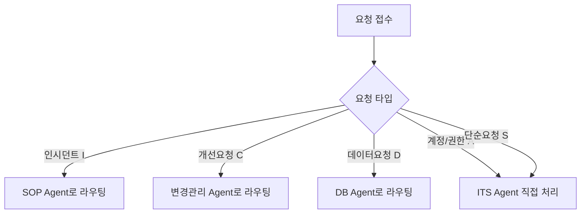
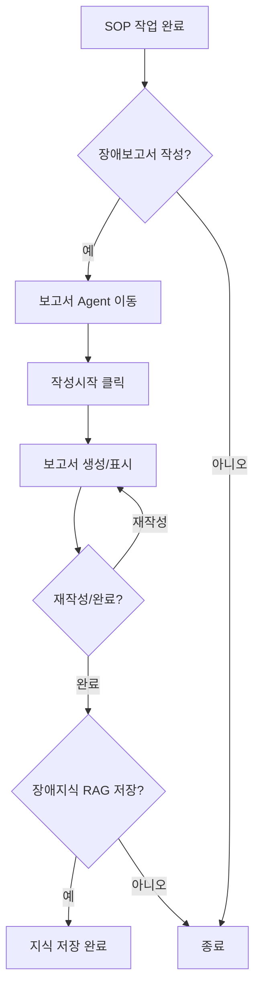
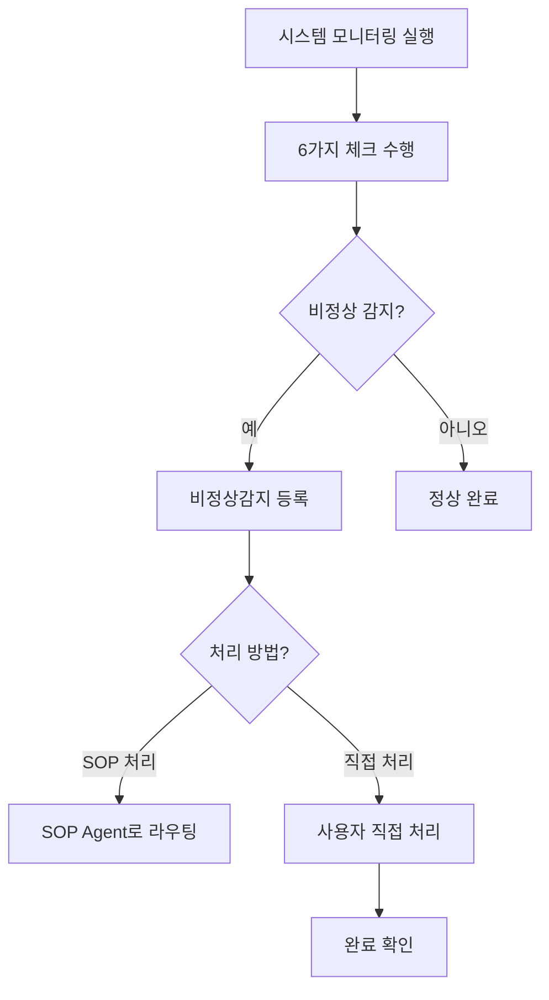

# AI Agent 운영 관리 시스템

## 시스템 개요

AI Agent 기반의 IT 운영 관리 시스템으로, 다양한 업무 영역의 자동화 및 효율적인 운영을 지원합니다. 각 Agent는 특화된 업무 도메인을 담당하며, 인간 승인 기반의 워크플로우를 통해 안전하고 신뢰성 있는 자동화를 제공합니다.

---

## 주요 기능

### 1. 다중 Agent 시스템

시스템은 7가지 전문 Agent로 구성되어 있습니다:

| Agent | 역할 | 주요 기능 |
|-------|------|----------|
| **ITS Agent** | IT 서비스 요청 관리 | 인시던트, 개선, 데이터, 계정/권한, 단순 요청 처리 |
| **SOP Agent** | 표준 운영 절차 관리 | 인시던트 처리, 장애 대응, 장애보고서 연계 |
| **DB Agent** | 데이터베이스 관리 | 데이터 요청 처리, DB 작업 지원 |
| **모니터링 Agent** | 시스템 모니터링 | 비정상 감지, 6가지 모니터링 카테고리 |
| **변경관리 Agent** | 변경 요청 관리 | 개선 요청 처리, 변경 계획 수립 |
| **보고서 Agent** | 보고서 생성 | 장애보고서, 변경계획서, 테스트시나리오 등 |
| **Biz.Support Agent** | 현업 지원 | 시스템 관련 문의/응답 |

### 2. 다국어 지원

- **한국어 (ko)**: 기본 언어
- **English (en)**: 영어
- **Tiếng Việt (vi)**: 베트남어

### 3. 테마 시스템

- **다크 테마**: 사이버 다크 테마 (Cyan/Teal 강조색, 글래스모피즘 효과)
- **라이트 테마**: 클린 화이트 배경

---

## 네비게이션 구조

```
├── Dashboard          # 대시보드 (최상단 고정)
├── Worker (SKI Agent) # 운영 Agent 목록
│   ├── ITS Agent
│   ├── SOP Agent
│   ├── DB Agent
│   ├── 모니터링 Agent
│   ├── 변경관리 Agent
│   ├── 보고서 Agent
│   └── Biz.Support Agent
├── My Agent           # 사용자 정의 Agent
│   ├── Agent Market   # Agent 마켓에서 추가
│   └── 등록된 Agent   # 시스템별 Agent 등록
└── Assistant          # AI 어시스턴트 채팅
```

---

## 워크플로우

### 1. ITS Agent 요청 처리 플로우



**요청 타입:**
- **(I) 인시던트요청**: 장애 및 문제 해결 → SOP Agent 연계
- **(C) 개선요청**: 시스템 개선 → 변경관리 Agent 연계
- **(D) 데이터요청**: 데이터 작업 → DB Agent 연계
- **(A) 계정/권한요청**: 접근 권한 관리
- **(S) 단순요청**: 일반 IT 지원

**ITS 요청 액션:**
- 업무량 등록하기
- 방화벽 신청하기
- DB Safer 신청하기
- Cloud 신청하기

### 2. SOP Agent 장애보고서 연계 플로우



### 3. 모니터링 Agent 비정상 감지 플로우



**모니터링 카테고리:**
1. HTTP API Check
2. DB 모니터링
3. IF 모니터링
4. BATCH 모니터링
5. LOG 모니터링
6. 성능 모니터링

### 4. 승인 기반 처리 워크플로우

모든 Agent는 인간 승인 기반 워크플로우를 따릅니다:

| Agent | 상태 레이블 | 승인 버튼 |
|-------|------------|----------|
| ITS Agent | 미접수 → 접수/처리중 → 완료 | 접수 / 반려 |
| SOP Agent | 접수 → 처리중 → 완료 | 처리 / 취소 |
| DB Agent | 접수 → 처리중 → 완료 | 처리 / 취소 |
| 변경관리 Agent | 접수 → 처리중 → 완료 | 처리 / 취소 |
| 모니터링 Agent | 감지 → 처리중 → 완료 | SOP 처리 / 직접 처리 |

---

## My Agent 시스템

### 2단계 계층 구조

1. **My Agent Type**: Agent Market에서 추가하는 Agent 유형
2. **Registered Agent**: My Agent Type 하위에 시스템별로 등록하는 실제 Agent

### 시스템 필터

- e-총무시스템
- BiOn
- SATIS

### Agent 설정 항목

- Agent 이름
- 설명
- 도구 선택
- 지식 베이스
- Instruction (마크다운 지원)

---

## Assistant 섹션

AI 어시스턴트와의 대화형 인터페이스로, 다양한 선택기를 통해 컨텍스트를 설정할 수 있습니다:

### 선택기 구성

| 선택기 | 타입 | 설명 |
|--------|------|------|
| System | 다중 선택 | 시스템 필터링 |
| Instruction | 단일 선택 | 대화 지침 설정 |
| Knowledge RAG | 다중 선택 | 지식 베이스 연결 |
| Knowledge Graph | 다중 선택 | 그래프 지식 연결 |
| Tool | 다중 선택 | 사용 도구 선택 |

---

## 보고서 Agent

### 지원 보고서 유형

1. **장애보고서**: 장애 발생 및 대응 내역
2. **변경계획서**: 시스템 변경 계획
3. **테스트시나리오**: 테스트 케이스 문서
4. **변경결과보고서**: 변경 후 결과 보고
5. **취합문서**: 종합 문서

각 보고서 유형별로 실행 및 설정 기능 제공

---

## 모니터링 설정

### 모니터링 카테고리 상세

1. **서비스 모니터링 - Application 서비스 확인**
   - HTTP API Health Check
   - 운영자 지정 Application Health Check
   - Crawling 탐색

2. **서비스 모니터링 - DB 서비스 확인**
   - DB 접속 여부
   - DB 쿼리 응답시간/Slow Query 탐색
   - DB DeadLock Check
   - DB File Size

3. **서비스 모니터링 - 사용자 지정 DB 모니터링 쿼리**
   - 운영자 지정 쿼리

4. **서비스 모니터링 - IF 및 배치 확인**
   - I/F Data 확인
   - I/F Log 확인
   - 배치 Data 확인
   - 배치 Log 확인

5. **Log 모니터링 - 로그 확인**
   - Application log 확인 (NPO)
   - Application log 확인 (Log tool)

6. **성능 모니터링 - Infra (Cloud) Agent 도구**
   - 서버 성능 조회 (CPU, Memory, I/O)
   - Application 성능조회

---

## 기술 스택

- **Frontend**: React 18, TypeScript, Vite
- **UI Framework**: Tailwind CSS, shadcn/ui
- **상태 관리**: React Query, React Context
- **라우팅**: React Router DOM
- **국제화**: i18next
- **차트**: Recharts
- **마크다운**: React Markdown

---

## 디자인 시스템

### 테마 변수

```css
/* 다크 테마 주요 색상 */
--primary: 180 100% 50%      /* Cyan */
--background: 220 20% 10%    /* 다크 배경 */
--accent: 180 100% 40%       /* 강조색 */

/* 상태 색상 */
--status-online: 142 76% 36%   /* 성공/온라인 */
--status-warning: 38 92% 50%   /* 경고 */
--status-error: 0 84% 60%      /* 에러 */
```

### 글래스모피즘 효과

```css
.glass-panel {
  background: rgba(var(--background), 0.8);
  backdrop-filter: blur(12px);
  border: 1px solid rgba(var(--border), 0.3);
}
```

### 커스텀 애니메이션

- `pulse-glow`: 발광 펄스 효과
- `float`: 부유 애니메이션
- `slide-up`: 슬라이드 업 등장
- `fade-in`: 페이드 인

---

## 폴더 구조

```
src/
├── components/
│   ├── agent/           # Agent 대시보드 컴포넌트
│   ├── chat/            # 채팅 관련 컴포넌트
│   ├── ui/              # shadcn/ui 컴포넌트
│   └── workflow/        # 워크플로우 관련 컴포넌트
├── data/
│   └── instructions.ts  # 공유 Instruction 데이터
├── hooks/               # 커스텀 훅
├── i18n/
│   ├── locales/         # 번역 파일 (en, ko, vi)
│   └── index.ts         # i18n 설정
├── pages/               # 페이지 컴포넌트
└── lib/                 # 유틸리티 함수
```

---

## 라이선스

© 2024 AI Agent 운영 관리 시스템. All rights reserved.
